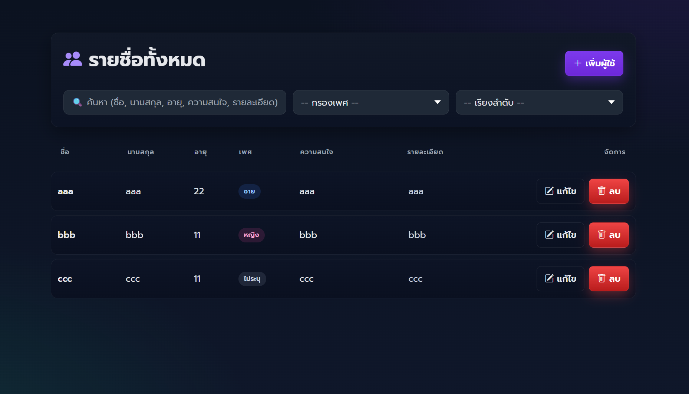
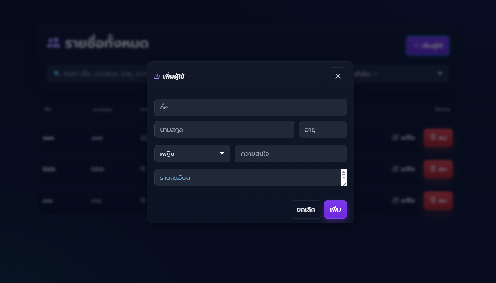
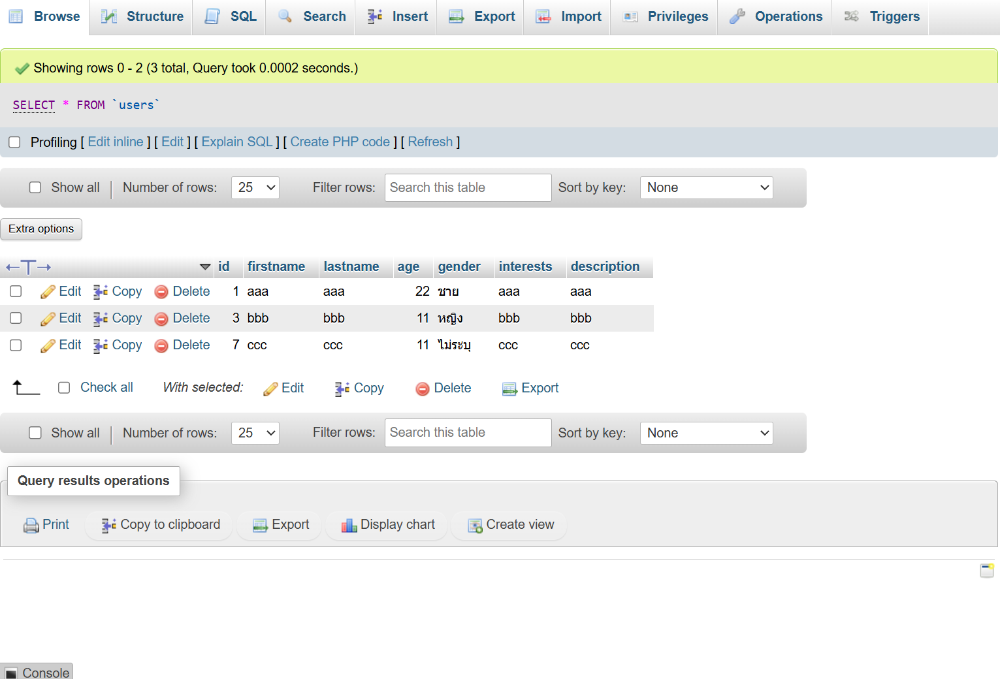

# โปรเจ็คส่วนตัว ปี 3 (2024)
# 📌 TodoWeb (Vue 3 + Express + MySQL)

โครงการส่วนตัวสำหรับฝึกพัฒนา Full‑Stack (2023) – สาธิตระบบจัดการผู้ใช้ (Create / Read / Update / Delete) พร้อมการ Validate ฝั่ง Backend และโครงสร้างที่ง่ายต่อการต่อยอด




---

## ✨ คุณสมบัติหลัก (Features)

- เพิ่ม / แสดง / แก้ไข / ลบ ผู้ใช้ (Users CRUD)
- ตรวจสอบข้อมูล (Validation) ฝั่งเซิร์ฟเวอร์ (ชื่อ, นามสกุล, อายุ, เพศ, ความสนใจ, คำอธิบาย)
- จัดเก็บข้อมูลใน MySQL (รันผ่าน Docker Compose + phpMyAdmin UI)
- โค้ด Backend สั้น กระชับ เหมาะสำหรับผู้เริ่มต้นศึกษา
- RESTful JSON API พร้อมตัวอย่างเรียกใช้งาน
- โครงสร้างโฟลเดอร์แยก frontend / server ชัดเจน
- รองรับต่อยอดทำ Auth, Upload, Pagination ได้ง่าย


---

## 🚀 เริ่มต้นใช้งานเร็ว (Quick Start)

### 1) รันฐานข้อมูลผ่าน Docker (แนะนำ)

```powershell
cd server
docker compose up -d
```

Services:
- MySQL: localhost:8830 (root / root, DB: webdb)
- phpMyAdmin: http://localhost:8831

นำเข้าไฟล์ `users.sql` ผ่าน phpMyAdmin หรือ CLI:
```powershell
mysql -h 127.0.0.1 -P 8830 -u root -proot webdb < ..\users.sql
```

### 2) ติดตั้ง Dependencies
```powershell
cd server
npm install
cd ../frontend
npm install
```

### 3) รัน Backend
```powershell
cd server
npm run dev
```
Output (คาดหวัง): `http server run at 8000`

### 4) รัน Frontend
```powershell
cd frontend
npm run dev
```
เปิด: http://localhost:5173

---

## 🔌 REST API สรุป (Summary)

Base URL: `http://localhost:8000`

| Method | Path          | คำอธิบาย          |
|--------|---------------|-------------------|
| GET    | /users        | ดึงผู้ใช้ทั้งหมด |
| GET    | /users/:id    | ดึงผู้ใช้รายคน   |
| POST   | /users        | เพิ่มผู้ใช้ใหม่   |
| PUT    | /users/:id    | แก้ไขข้อมูลผู้ใช้ |
| DELETE | /users/:id    | ลบผู้ใช้          |

ตัวอย่างเพิ่มผู้ใช้:
```bash
curl -X POST http://localhost:8000/users \
	-H "Content-Type: application/json" \
	-d '{
		"firstname": "John",
		"lastname": "Doe",
		"age": 21,
		"gender": "ชาย",
		"interests": "Coding, Music",
		"description": "Sample user"
	}'
```

กรณีข้อมูลไม่ครบ เซิร์ฟเวอร์จะตอบ:
```json
{
	"message": "กรอกข้อมูลไม่ครบ",
	"errors": ["กรุณากรอกชื่อ", ...]
}
```

# ภาพตัวอย่างการใช้งาน




